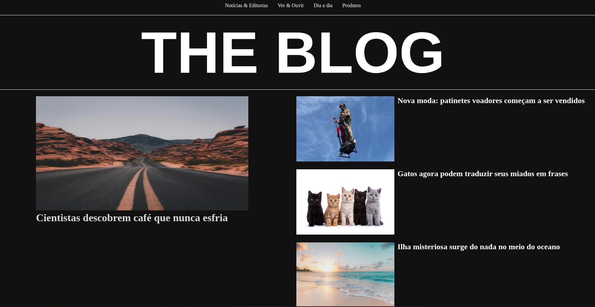
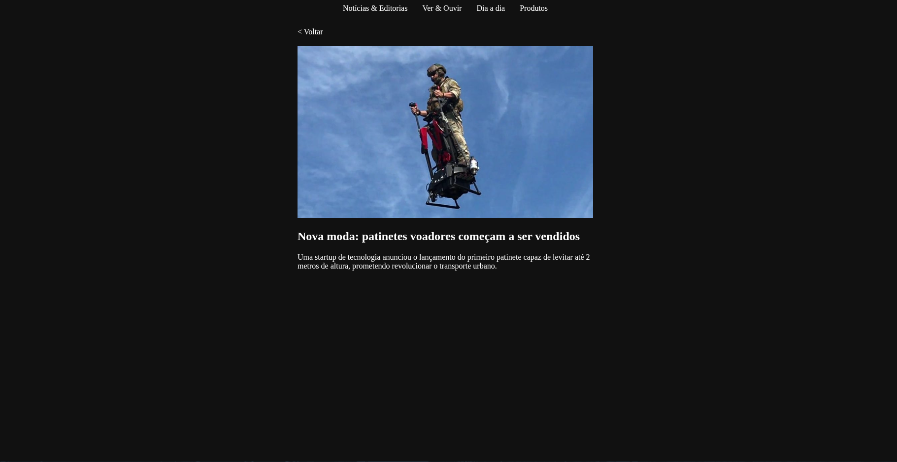

# 📖 Blog Simples em Angular

Este é o meu **primeiro projeto em Angular** 🚀.  
Trata-se de um **blog bem simples**, criado com o objetivo de aprender os conceitos básicos do framework, como:

- Estrutura de componentes
- Data binding
- Diretivas
- Roteamento básico

---

## ⚡ Tecnologias utilizadas

- [Angular 14+](https://angular.io/)
- [TypeScript](https://www.typescriptlang.org/)
- HTML5 e CSS3

---

## 📷 Screenshots

### Página inicial



### Página de detalhes



## ▶️ Como executar o projeto

1. **Clonar o repositório:**

```bash
git clone https://github.com/seu-usuario/seu-repo.git

cd blog-angular

npm install

ng serve

```
